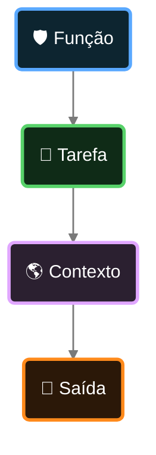
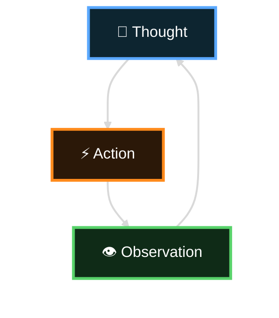
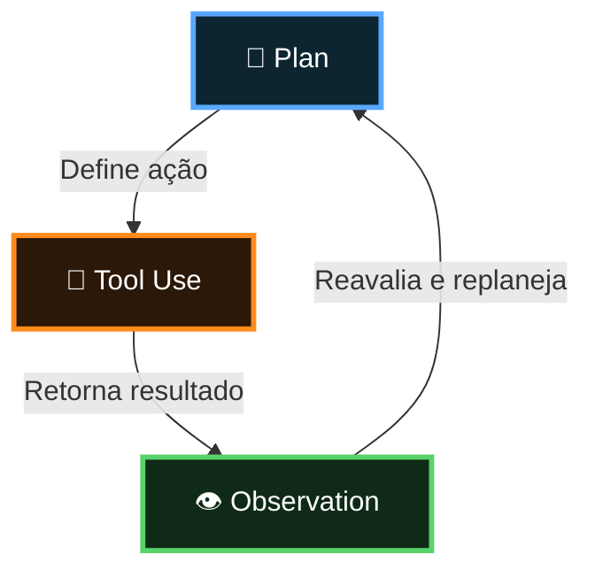
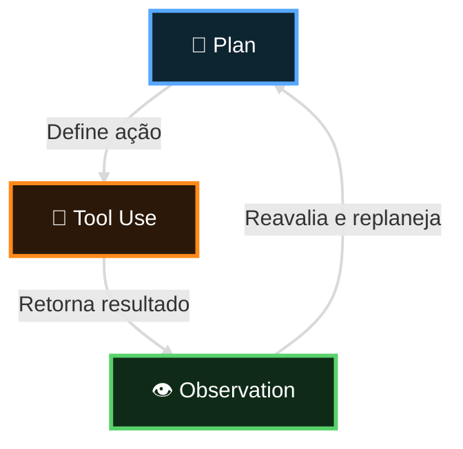
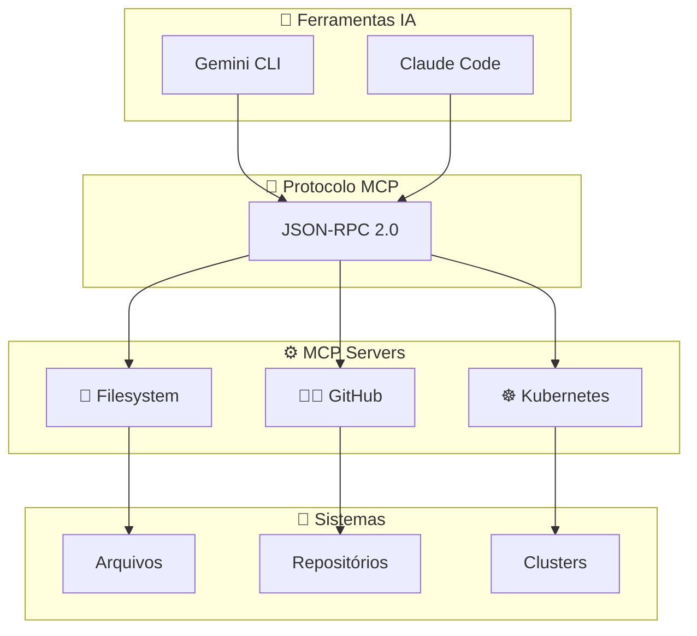

Estrutura Base
 - Função: Quem o modelo é
 - Tarefa: O que deve fazer
 - Contexto: informações do seu ambiente
 - Saida: como entregar a resposta

## Estrutura do Prompt



## Ciclo Thought, Action e Observation



## Loop Agentic com Tool Use


```
Analise o projeto /home/jmarcelotse/devops/aiops-xp-platform/encontros-tech e me diga qual é a stack do projeto. Como faço para executar localmente e quais sao os principais recursos

Detalhe mais o modelo da dados da aplicação
```
## Arquitetura MCP


## Arquitetura Host-Client-Server

```mermaid
flowchart TB
    H["🖥️ Host<br/>Gemini CLI"]
    C["🔗 MCP Client"]
    S["⚙️ MCP Server<br/>Kubernetes"]

    H --> C --> S

    classDef host fill:#123047,stroke:#5aa9ff,stroke-width:2px,color:#ffffff;
    classDef client fill:#3a2208,stroke:#ff8a1c,stroke-width:2px,color:#ffffff;
    classDef server fill:#17361f,stroke:#5ad67d,stroke-width:2px,color:#ffffff;

    class H host;
    class C client;
    class S server;

    linkStyle 0 stroke:#d9d9d9,stroke-width:2px;
    linkStyle 1 stroke:#d9d9d9,stroke-width:2px;